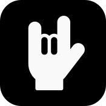

<h1 align="center">Metal Releases</h1>

Flutter app that displays this week's metal album releases as well as future and past releases.
This is the first app I built with Flutter, starting in December 2018.

[Google Play Store](https://play.google.com/store/apps/details?id=de.florianweinaug.albumreleasesapp)

## Screenshots

<table>
  <tr>
    <td>This week</td>
    <td>Upcoming</td>
    <td>Search</td>
  </tr>
  <tr>
    <td></td>
    <td></td>
    <td></td>
  </tr>
</table>
